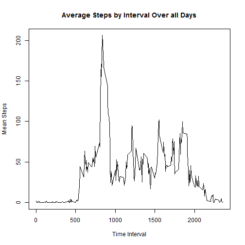

Part I:

Question 1:

I loaded the data using read.csv.  I had already downloaded the folder into my directory before reading the data into R.

Question 2:

I did not do any preprocessing, except for loading dplyr that I used extensively in the rest of the questions


```r
wd<-read.csv(file = "./repdata-data-activity/activity.csv")
library(dplyr)
```

```
## 
## Attaching package: 'dplyr'
## 
## The following object is masked from 'package:stats':
## 
##     filter
## 
## The following objects are masked from 'package:base':
## 
##     intersect, setdiff, setequal, union
```

Part II

Question 1:

I calculated the total number of steps each day by grouping the data by the date (group_by), and then summed the steps over each day (summarize).  I used na.rm=TRUE in the summation, which ignored any NA values (and replaced them with zeros when the whole day was NAs) when calculating the total number of steps.


```r
wdstepsum<-wd%>%
  group_by(date)%>%
  summarize(sum(steps, na.rm=TRUE))
```

Question 2:

To create a histogram of the summarized data, I needed to convert the second column of wdstepsum to integers (because it contains the total steps per day), so the column is accepted by the histogram function.  I accomplished this by converting the entire wdstepsum table into a data.frame, which (among other thigs) converted the second column to integer values.  I then called the histogram function with a few extra arguments to improve readability.


```r
wdstepsum<-as.data.frame(wdstepsum)
hist(wdstepsum[,2],xlab = "Steps taken per day", main = "Histogram of Steps Taken per Day", breaks = 20, labels = T, xlim = c(0,25000), ylim = c(0,15))
```

 

Question 3:

I calculated the mean and median using the R functions mean() and median() of the second column of the wdstepsum (since that column contains the total steps per day for each day).


```r
mean(wdstepsum[,2])
```

```
## [1] 9354.23
```

```r
median(wdstepsum[,2])
```

```
## [1] 10395
```

Part III

Question 1:

To answer this question, I grouped the walking data by interval, then found the mean steps for each respective interval across all of the data.  To use that data in a time series plot, I converted the data set into a data.frame (so the time intervals and the mean steps would be integers and doubles respectively), then plotted the data with the time interval on the x-axis and the mean steps on the y-axis.


```r
wdintervalmean<-wd%>%
  group_by(interval)%>%
  summarize(mean(steps, na.rm=T))
wdintervalmean<-as.data.frame(wdintervalmean)
plot(wdintervalmean[,1], wdintervalmean[,2], xlab = "Time Interval", ylab = "Mean Steps", main = "Average Steps by Interval Over all Days", type = "l")
```

 

Question 2:

To find the maximum mean step value and the associated time interval, I used the dplyr function filter() and filtered the data set (weintervalmean) by the maximum value of the second column.  As seen below, the maximum mean steps is 206.1698 at time interval 835.


```r
filter(wdintervalmean, wdintervalmean[,2] == max(wdintervalmean[,2]))
```

```
##   interval mean(steps, na.rm = T)
## 1      835               206.1698
```

Part IV:

Question 1:

To find the number of rows in the data set that are "NA", I filtered the data set by the NA values, then counted the rows in that subset.

```r
nrow(filter(wd, is.na(steps)))
```

```
## [1] 2304
```

Question 2&3:

I decided to change the NA values to the mean values of the corresponding 5-minute interval.  I chose this method because some days may be entirely NA values.

To accomplish this, I made a new table wdnoNA, and constructed a for loop that searched for NA values in the rows of the first column of wdnoNA; if the row had an NA value, I replaced that NA value with the corresponding mean time interval value.  If the row did not have a NA value, the row was skipped and the next row was checked.


```r
wdnoNA<-wd
for (i in 1:length(wdnoNA[,1])){
  if (is.na(wdnoNA[i,1])){
    wdnoNA[i,1] <- wdintervalmean[match(wdnoNA[i,3], wdintervalmean[,1]),2]
  }
  else{next}
}
```

Question 4:

The estimates for mean and median when NA values are replaced (mean: 10766.19, median: 10766.19) differ drastically from the estimates when NA values are not replaced (mean: 9354.23, median: 10395).  When in impute missing data, we create a bias in our estimates that; in our case, the imputation increases the mean and median number of steps taken per day.

```r
wdnoNAstepsum<-wdnoNA%>%
  group_by(date)%>%
  summarize(sum(steps))
wdnoNAstepsum<-as.data.frame(wdnoNAstepsum)
mean(wdnoNAstepsum[,2])
```

```
## [1] 10766.19
```

```r
median(wdnoNAstepsum[,2])
```

```
## [1] 10766.19
```

```r
wdnoNAstepsum<-as.data.frame(wdnoNAstepsum)
hist(wdnoNAstepsum[,2],xlab = "Steps taken per day", main = "Histogram of Steps Taken per Day", breaks = 20, labels = T, xlim = c(0,25000), ylim = c(0,20))
```

 

Part V

Question 1:

To create a weekday column, I first mutated the walking data so the date column was transformed into the Date class.  Then I created a new column that took the date from the date column and determined the corresponding day of the week using the weekdays() function.  After that, I looped through the weekdays column to change any weekday (Monday-Friday) to contain the string "Weekday", and any weekend (Saturday-Sunday) to contain the string "Weekend".


```r
wdweekdays<-mutate(wdnoNA, date = as.Date(date))
wdweekdays<-mutate(wdweekdays, weekday = weekdays(date))
for (i in 1:length(wdweekdays[,4])){
  if (wdweekdays[i,4] == "Monday"){
    wdweekdays[i,4]<-"Weekday"
  }
  else if (wdweekdays[i,4] == "Tuesday"){
    wdweekdays[i,4]<-"Weekday"
  }
  else if (wdweekdays[i,4] == "Wednesday"){
    wdweekdays[i,4]<-"Weekday"
  }
  else if (wdweekdays[i,4] == "Thursday"){
    wdweekdays[i,4]<-"Weekday"
  }
  else if (wdweekdays[i,4] == "Friday"){
    wdweekdays[i,4]<-"Weekday"
  }
  else if (wdweekdays[i,4] == "Saturday"){
    wdweekdays[i,4]<-"Weekend"
  }
  else if (wdweekdays[i,4] == "Sunday"){
    wdweekdays[i,4]<-"Weekend"
  }
}
```

Question 2:

To create the plot, I grouped the weekday data by both the weekday (weekday or weekend), and by interval.  Then I found the mean of the steps; the order of the groupings, weekday then interval, allowed for the mean steps to be caluclated so that weekend and weekday had separate values for each interval.  I then transformed the data set into a data.frame so ensure any numbers were considered doubles or integers.

I used the package ggplot2 to construct my plot.  I ensured that the weekend mean step intervals were plotted separately from the weekday mean step intervals.   


```r
wdweekdaysmean<-wdweekdays%>%
  group_by(weekday, add = T)%>%
  group_by(interval, add = T)%>%
  summarize(mean(steps))
wdweekdaysmean<-as.data.frame(wdweekdaysmean)
library(ggplot2)
g<-ggplot(wdweekdaysmean, aes(wdweekdaysmean[,2], wdweekdaysmean[,3]))
g+geom_line()+facet_grid(weekday~.)+labs(title = "Mean Interval Steps Taken Separated by Weekday or Weekend", x = "Time Interval", y = "Mean Steps Taken")
```

 
